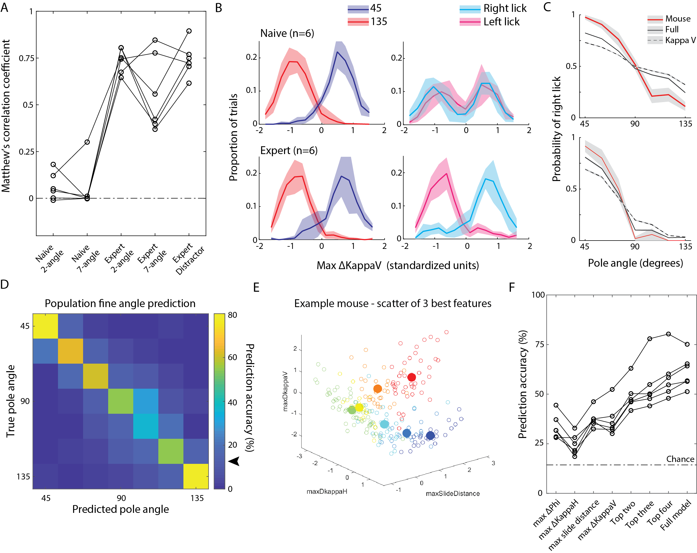

## Project: Angle Discrimination Behavior Analysis

Scripts primarily used to analyze behavioral choice in object angle discrimination of mice. 

Primary question: what are the neural correlates of object angle representaition in mouse vS1? So, why look at behavior? 
Whisker dependent features obtained and choice parameters made by rodents will inform and reduce the search space of what whisker dependent features will drive object angle representation in vS1.

## Questions targeted to behavioral choice:
1) What whisker dependent touch features best discriminate coarse (45 vs 135) and fine (45:15:135) angles? 
2) Which whisker dependent touch features are most important in driving angle perception? 

## Main scripts: 
main_builder - primary script used to package trial by trial whisker motion into a struct 
main_figure_builder - script used to compile main and supplemental figures for publication. 
master_figure_builder - script for detailed adhoc plots and analysis. 

### Summary figure: 

## Requirements:
glmnet from Qian and Hastie (2013) - https://web.stanford.edu/~hastie/glmnet_matlab/  
HLab_matlabTools which can be forked from jkim0731.  

Written and built in MATLAB 2018b

